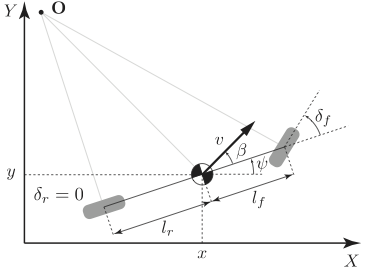
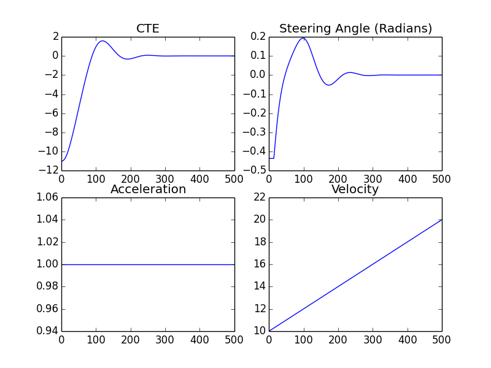

# Model Predictive Control (MPC)

In this project, we implement Model Predictive Control to drive a car autonomously around a track. As the car drives around the track, we will be given a stream of waypoints and the car's position (in the world coordinate system), its throttle, speed, steering angle, and direction. The task in this project is to first model the car's motion using the Kinematic Bicycle model. Then using this model, build and tune an MPC controller to optimally throttle and steer the car such that it follows the track safely and with maximum comfort to its riders. In addition, the car's model and its controller must be efficiently implemented to ensure real time execution. We will need to calculate the cross-track error and account for a 100 millisecond latency between actuation commands on top of the connection latency. 

<p align="center">
  
</p>


---

## Kinematic Bicycle Model

In order to control the car, we need to accurately and efficiently predict its behaviour (state) in response to different actuator commands such as throttle and steering. In this project, we use the simple Kinematic Bicycle model to achive this. The kinematic bicycle model for a car reduces the front and rear pairs of wheels into single front and rear wheels as shown in the figure below. 

<p align="center">
  
</p>

The model uses the vehicle's current state at step t in terms of its position (x<sub>t</sub>, y<sub>t</sub>), speed v<sub>t</sub>, direction &psi;<sub>t</sub>, and the MPC's control signals throttle a<sub>t</sub> and steering angle &delta;<sub>t</sub> to predict its next state at step t+1 after &Delta;t seconds. The model ignores tire dynamics such as slip angle and slip ratio and other forces like air resistance, drag, etc. The following equations describe the bicycle kinematic model we use:

x<sub>t+1</sub> = x<sub>t</sub> + v<sub>t</sub> &lowast; &Delta;t &lowast; cos(&psi;<sub>t</sub>)

y<sub>t+1</sub> = y<sub>t</sub> + v<sub>t</sub> &lowast; &Delta;t &lowast; sin(&psi;<sub>t</sub>)

&psi;<sub>t+1</sub> = &psi;<sub>t</sub> + v<sub>t</sub>/Lf &lowast; &Delta;t&lowast; &delta;<sub>t</sub>

v<sub>t+1</sub> = v<sub>t</sub> + a<sub>t</sub> &lowast; &Delta;t

The parameter Lf here is the distance between the front axle of the car and its center of mass. It is empircally determined by driving the car in a circle at constant speed and steering angle. The value used in this project is 2.67.

An important requirement in designing an MPC is to follow the reference trajectory with minimal cross-track error (CTE). Cross track error is the distance between the vehicle's lateral position y and the trajectory defined by the polynomial f(x). The function f is typically a third order polynomial fitted to the waypoints provided at time step t. The following equation computes CTE at step t+1 using the vehicle's longitudinal position, its speed and orientation error at step t:

cte<sub>t+1</sub> = f(x<sub>t</sub>) - y<sub>t</sub> + v<sub>t</sub> &lowast; &Delta;t &lowast; sin(e&psi;<sub>t</sub>)

The orientation error e&psi; which is defined as follows:

e&psi;<sub>t+1</sub> = &psi;<sub>t</sub> - &psi;des<sub>t</sub> + v<sub>t</sub>/Lf &lowast; &Delta;t &lowast; &delta;<sub>t</sub>

The term &psi;des<sub>t</sub> here is the the desired direction at time step t. It is not readily provided, but it can be computed by finding the slope of the trangent line to the reference trajectory (f(x)) at location x<sub>t</sub> and then computing the angle of the slope. 

## MPC
The basic idea of <span style="color:blue">*Model*</span> <span style="color:red">*Predictive*</span> *Control* is to use the kinematic <span style="color:blue">*Model*</span> of the car to <span style="color:red">*Predict* or Simulate</span> how its state (position, speed, etc.) would change to different actuator (steering angle and throttle) settings and then choose the best/optimal actuation setting that minimizes CTE, e&psi;, sudden and/or excessive use of acceleration/braking/steering, etc.

Typically, we predict or simulate the car's state for a predefined length of time in the future. In this project, we set our prediction horizon to 1 second which is about 22 meters in terms of distance for a speed of ~50 MPH. During this time, we wish to have a very accurate picture of the state of the vehicle. Therefore, we discretize the 1-second period into (&Delta;t=) 50 millisecond-wide steps. As a result, we end up with (N=) 20 states of positions, speeds, and directions that should match with the reference waypoints, pre-defined speeds, and direction. We use the C++ Ipopt optimizer to find the optimal set of (20-1=) 19 throttle and steering angle values that render the car's future 20 states as close to the reference states as possible. 

Choosing the values for the parameters N and &Delta;t was first based on guessing and I then fine tuned the values based on intiution and trial-and-error. I started off with a small &Delta;t value of 0.001 and realized the car was moving too slow. I then fixed N to roughly the number of waypoints and increased &Delta;t to 0.01 and then 0.05. The values of N=20 and &Delta;t = 0.05 seconds gave the best performance for the number of combinations of N & &Delta;t I tried.    

Even though we predict states and find optimal actuators for many time steps in the future, we only take the first throttle and steering angle values from the 19 pairs found by the optimizer and discard the next 18. We then apply this pair of actuators to the car. Instead of applying the next 18 actuator commands that we discarded, we will just repeat the entire process of: (i) state and waypoints collenction, (ii) trajectory polynomial fitting, and (iii) optimization to get the next single pair of throttle and steering angle. We apply these commands to the car and repeat the loop until the car reaches its destination. For optimal vehicle control, we should sample the state of the vehicle and produce the next actuator commands as often as it is computationally possible. 

To give a simple example about MPC, let's assume that the car's current location is (x=0, y=10) and the reference trajectory is a straight line from the point (x=0, y=-1) to the point, say, (x=100, y=-1). Feeding this into our control signals' optimizer we get the results shown in the figure below. 

<p align="center">
  
</p>

The figure shows that the vehicle starts with CTE of -11 and it reaches 0 error after ~250 steps. The steering angle is changing smoothly to avoid dangerous and abrupt change of direction. The throttle is held constant at 1 (maximum value allowed) since the car's speed has not met the refernce value of 40 MPH. The throttle would go to zero when speed reaches 40 MPH had we run the simulation a little longer. This simulation was implemented in [Python/TensorFlow](https://github.com/ashtawy/model_predictive_control_in_tensorflow/blob/master/model_predictive_control_in_tensorflow.ipynb) as well as [C++/Ipopt](https://github.com/ashtawy/model_predictive_control_in_tensorflow/blob/master/src/MPC.cpp). 

## Connection and Latency Delay
A typical car does not respond to actuator commands (e.g., acceleration) immediately. Rather, there is some finite delay between the initiation of the command and the time when the car's state changes due to latency or other physical constraints. Such delays must be accounted for when desinging the controller system. Otherwise, the steering and/or throttle commands that were calculated based on the assumption that the car is in a certain state may not be valid since they will take affect too late when the car has moved to a new different state. 

The remedy for this delay problem is fairly simple when controlling a vehicle using MPC. The trick is to predict the car's state after the latency time has elapsed and find the optimal steering and throttle values for that future state. The prediction step is done using the kinematic bicycle model describe above. We simply assign &Delta;t in the equatinos above to the latency time (100 ms) and use the new state of the vehicle as if it were the current state.   


---

## Dependencies

* cmake >= 3.5
 * All OSes: [click here for installation instructions](https://cmake.org/install/)
* make >= 4.1(mac, linux), 3.81(Windows)
  * Linux: make is installed by default on most Linux distros
  * Mac: [install Xcode command line tools to get make](https://developer.apple.com/xcode/features/)
  * Windows: [Click here for installation instructions](http://gnuwin32.sourceforge.net/packages/make.htm)
* gcc/g++ >= 5.4
  * Linux: gcc / g++ is installed by default on most Linux distros
  * Mac: same deal as make - [install Xcode command line tools]((https://developer.apple.com/xcode/features/)
  * Windows: recommend using [MinGW](http://www.mingw.org/)
* [uWebSockets](https://github.com/uWebSockets/uWebSockets)
  * Run either `install-mac.sh` or `install-ubuntu.sh`.
  * If you install from source, checkout to commit `e94b6e1`, i.e.
    ```
    git clone https://github.com/uWebSockets/uWebSockets
    cd uWebSockets
    git checkout e94b6e1
    ```
    Some function signatures have changed in v0.14.x. See [this PR](https://github.com/udacity/CarND-MPC-Project/pull/3) for more details.

* **Ipopt and CppAD:** Please refer to [this document](https://github.com/udacity/CarND-MPC-Project/blob/master/install_Ipopt_CppAD.md) for installation instructions.
* [Eigen](http://eigen.tuxfamily.org/index.php?title=Main_Page). This is already part of the repo so you shouldn't have to worry about it.
* Simulator. You can download these from the [releases tab](https://github.com/udacity/self-driving-car-sim/releases).
* Not a dependency but read the [DATA.md](./DATA.md) for a description of the data sent back from the simulator.


## Basic Build Instructions

1. Clone this repo.
2. Make a build directory: `mkdir build && cd build`
3. Compile: `cmake .. && make`
4. Run it: `./mpc`.

## Tips

1. It's recommended to test the [MPC on basic examples](https://github.com/ashtawy/model_predictive_control_in_tensorflow) to see if your implementation behaves as desired. One possible example
is the vehicle starting offset of a straight line (reference). If the MPC implementation is correct, after some number of timesteps
(not too many) it should find and track the reference line.
2. The `lake_track_waypoints.csv` file has the waypoints of the lake track. You could use this to fit polynomials and points and see of how well your model tracks curve. NOTE: This file might be not completely in sync with the simulator so your solution should NOT depend on it.
3. For visualization this C++ [matplotlib wrapper](https://github.com/lava/matplotlib-cpp) could be helpful.)
4.  Tips for setting up your environment are available [here](https://classroom.udacity.com/nanodegrees/nd013/parts/40f38239-66b6-46ec-ae68-03afd8a601c8/modules/0949fca6-b379-42af-a919-ee50aa304e6a/lessons/f758c44c-5e40-4e01-93b5-1a82aa4e044f/concepts/23d376c7-0195-4276-bdf0-e02f1f3c665d)
5. **VM Latency:** Some users have reported differences in behavior using VM's ostensibly a result of latency.  


## Code Style

Stick to [Google's C++ style guide](https://google.github.io/styleguide/cppguide.html).

